# Case Document Management System: Architecture

**Status:** Draft v0.7

**Scope:** Single-user, local-first system for managing, searching, and analysing documents and communications relating to an ongoing court case.

**Changes from v0.3:** Added corpus sizing, hardware constraints, and model selection; introduced PaddleOCR as the primary OCR engine; added document routing for in camera material and bank statements; added tiered extraction to manage CPU-bound processing.

**Changes from v0.4** Join tables added for message participants and event entities. Constraints, enumerations, and indexes are now defined. Review kinds and thread confidence are specified. Migration `0001_initial.sql` is the authoritative schema; this section describes it.

**Changes from v0.5** Reflect implementation of vector tables for chunks as in `0002_fts.sql`

**Changes from v0.6** Document expected folder structure for input documents

**Changes from v0.7** Document route types and restrictions

**Changes from v0.8** Document record creation (STORY-2.8) and the ingestion CLI (STORY-2.6) are implemented. This adds the `document_route_change` audit table, documents the title-follows-most-restrictive rule, and updates the ingestion pipeline description to match the implemented behaviour.

---

## 1. Purpose and Scope

### 1.1 Goals

| # | Goal | Success Criterion |
|---|------|-------------------|
| G1 | Ingest mixed-format case material | PDFs, Word documents, Gmail exports, and images are imported with provenance and checksums |
| G2 | Support retrieval | Keyword and semantic search return relevant passages with source citations |
| G3 | Build timelines of events | A chronological view of occurrences, each linked to supporting documents |
| G4 | Build communication chains | Email threads and correspondence sequences are reconstructed and navigable |
| G5 | Link related material | Entities (people, organisations, places, issues) are connected across documents |
| G6 | Answer questions with citations | Natural-language queries are answered from the documents, with references |

### 1.2 Non-Goals

- **Not a system of record for evidence.** Original files remain the authoritative copies.
- **Not multi-user.** No authentication, roles, or concurrency control beyond what SQLite provides.
- **Not a source of legal advice.** The system surfaces and organises material; interpretation rests with the user and their legal advisers.
- **Not a case-management platform.** Court filings, deadlines, and billing are out of scope.
- **Not a financial analysis tool.** Bank statements are handled by a separate system (Section 7.1).

---

## 2. Design Principles

1. **Local-first.** All data, models, and indexes reside on the user's machine. Cloud services are optional, explicitly enabled per document class, and logged.
2. **Originals are immutable.** The database indexes files and never modifies them. Every derived record traces back to a file hash.
3. **Provenance throughout.** Every chunk, entity, event, and edge records its source (document, page or paragraph, extraction method, model version).
4. **Machine output is reviewable.** AI-generated links and events carry a confidence value and a review status. Nothing machine-generated is treated as fact without confirmation.
5. **Simple, inspectable storage.** One SQLite database plus a folder of originals. Backup, copy, and query use standard tools.
6. **Rebuildable derivations.** Chunks, embeddings, and extractions can be regenerated from originals and recorded model versions.
7. **Routing before processing.** Every document is classified before any processing occurs. Classification determines whether a document may be chunked, embedded, sent to cloud services, or excluded.

---

## 3. Operating Environment

### 3.1 Corpus Profile

| Attribute | Estimate | Implication |
|-----------|----------|-------------|
| Documents (PDF and Word) | Several hundred | Modest; indexing time measured in hours |
| Pages per document | Mostly a few; some up to ~200 | Chunk counts are dominated by long documents |
| Emails | Several thousand (unmanaged to date) | Thread reconstruction and deduplication matter; bulk LLM extraction is impractical |
| Image and scanned material | Mixed; many low-quality scans | OCR quality is the principal risk for this subset |
| In camera material | Present | Requires a restricted processing route (Section 7.1) |
| Bank statements | Present | Excluded from chunking and embedding; handled by a separate tool |

**Indicative volumes:** With roughly 300 to 600 documents and several thousand emails, the corpus is likely to yield between 20,000 and 60,000 chunks. At 1,024 dimensions (32-bit floats), vector storage is approximately 100 to 250 MB. These figures are estimates and should be confirmed from the first ingestion run.

### 3.2 Hardware

| Component | Specification | Implication |
|-----------|---------------|-------------|
| CPU | Intel Core i7-8750H (6 cores, 12 threads) | Embedding and OCR run on CPU; throughput is moderate |
| Memory | 32 GB RAM | Adequate for 7 to 8 billion parameter quantised models |
| GPU | NVIDIA GTX 1050 Ti Mobile, 4 GB VRAM | Limited; small models only on GPU, larger models partially offloaded or CPU-bound |
| Model storage | External drive (E:) | Ollama model directory set via `OLLAMA_MODELS`; application data stored on internal drive |

**Performance note:** CPU-bound LLM inference on this hardware generates tokens slowly. Per-chunk LLM extraction across the full corpus is therefore treated as a batch job, not an interactive step (Section 7.4).

### 3.3 Observed Issues

| Observation | Assessment | Response |
|-------------|-----------|----------|
| Qwen2 produced poor key-value extraction from scanned receipts | Likely driven by OCR quality on the input rather than by the model alone | Improve OCR (PaddleOCR) before changing the model; re-test |
| Low-quality scans may defeat Tesseract | Probable | Use PaddleOCR as the primary OCR engine; retain Tesseract as a fallback only |
| Gemini produced better extraction on text data | Plausible, as text input is less degraded | Maintain cloud extraction as an option for non-restricted documents |

---

## 4. Technology Decisions

### 4.1 Summary

| Concern | Selected | Alternatives Considered | Rationale |
|---------|----------|-------------------------|-----------|
| Language | Python 3.11+ | TypeScript, Go | Strongest ecosystem for document parsing, embeddings, and Ollama clients |
| Primary store | SQLite (single file) | PostgreSQL | Zero operational overhead; sufficient for one user and this corpus |
| Full-text search | SQLite FTS5 | Tantivy, Meilisearch | Built in; exact-match search matters for names, dates, and reference numbers |
| Vector search | sqlite-vec | LanceDB, Qdrant, Chroma | Co-located with all other data; vectors and metadata join in one query |
| Graph | SQLite edge tables (Kuzu as a possible later addition) | Neo4j, Kuzu | Most relationships are shallow and served well by relational tables |
| Embeddings | Ollama, local model (`bge-m3` preferred; `nomic-embed-text` as fast alternative) | Gemini embedding API | Keeps text local; selection based on measured retrieval quality |
| LLM tasks | Ollama, local model (`qwen2.5:7b-instruct` preferred; `qwen2.5:3b-instruct` as faster alternative) | Gemini for non-restricted text | Local by default; cloud use is per document class |
| OCR | PaddleOCR (primary); Tesseract (fallback only) | Tesseract only, commercial OCR | Better accuracy on degraded scans; already installed |
| Layout analysis | PaddleOCR structure tooling, or `docling` | `pdfplumber` | Preserves page and table structure where available |
| PDF text extraction | `pymupdf` for native text layers; OCR for image-only pages | `pdfplumber` | Fast; avoids OCR where a text layer exists |
| Word extraction | `python-docx`, with `docling` for complex layouts | LibreOffice conversion | Native, reliable |
| Email ingestion | Google Takeout MBOX, parsed with Python `mailbox` | IMAP live sync, Gmail API | Offline, complete, no persistent credentials |
| User interface | Local web application (FastAPI backend; Streamlit or HTMX frontend) | Desktop GUI (Qt), CLI only | Supports timeline and graph visualisation on localhost |

### 4.2 Model Selection

| Task | Primary Choice | Alternative | Notes |
|------|----------------|-------------|-------|
| Embedding | `bge-m3` (1,024 dimensions) | `nomic-embed-text` (768 dimensions) | `nomic-embed-text` is much smaller and faster on CPU; `bge-m3` is expected to give better retrieval. Measure both (Section 11) |
| Extraction (text) | `qwen2.5:7b-instruct`, Q4 quantisation | `qwen2.5:3b-instruct` | 7B gives better extraction; 3B is faster for batch runs |
| Extraction (cloud, non-restricted) | Gemini API | — | Used where quality gain justifies it and document class permits |
| Vision (images without text) | A small local vision model via Ollama | Gemini (non-restricted only) | Limited to a small number of images; GPU memory is constrained |

Model files are stored on the external drive (E:). Attention should be given to load times when switching models, as models must be read from external storage.

### 4.3 Rationale Notes

**SQLite with sqlite-vec rather than a dedicated vector database.**
A dedicated vector database provides value at millions of vectors and with concurrent users. At the expected scale of tens of thousands of chunks, exact search is fast. With sqlite-vec, a single query can combine vector similarity with date filters, document-type filters, and entity joins. The trade-off is that sqlite-vec is a younger project with fewer advanced index options.

**PaddleOCR over Tesseract as primary OCR.**
Tesseract performs well on clean, high-resolution scans but degrades quickly on skewed, low-contrast, or noisy input. PaddleOCR's detection and recognition models are generally more robust under these conditions, and it is already installed. Tesseract is retained as a fallback for cases where PaddleOCR fails.

**Local embeddings and extraction by default.**
Local processing avoids per-call cost and rate limits, supports offline operation, and allows vectors and extractions to be regenerated freely. This is particularly important for in camera material, which may not be appropriate for cloud processing regardless of provider assurances. The principal caveat is quality: local models trail the best hosted models on many benchmarks. Selection is based on measurement rather than assumption.

**Structure-aware chunking rather than LLM-based semantic chunking.**
LLM-based chunking is slow on this hardware and produces boundaries that are difficult to reproduce. Legal material has explicit structure (numbered paragraphs, headings, pages, email messages), and these units are citable. Chunk boundaries are deterministic.

**SQLite edge tables rather than a graph database.**
The principal queries are shallow: documents mentioning a person, emails sent by an organisation in a given period, events linked to an issue. A graph database becomes justified if multi-hop traversal becomes routine. The schema permits migration to Kuzu.

---

## 5. System Context

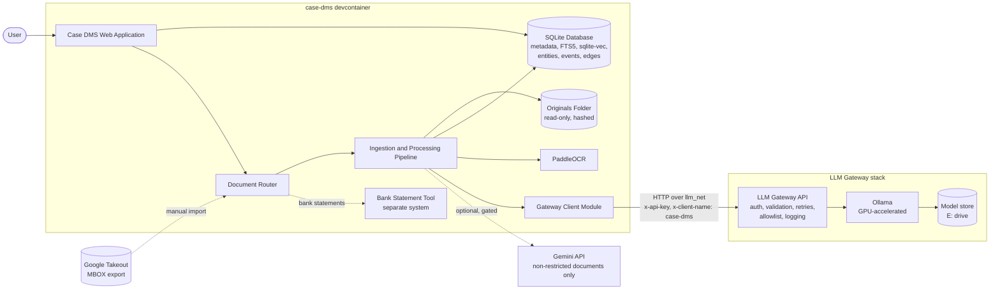

### 5.1 External Interfaces

| Interface | Direction | Protocol | Purpose | Controls |
|-----------|-----------|----------|---------|----------|
| LLM Gateway `POST /embed` | case-dms → gateway | HTTP (JSON) | Chunk and query embeddings | API key, model allowlist, batch size limit |
| LLM Gateway `POST /generate` | case-dms → gateway | HTTP (JSON) | Answer generation for RAG | API key, model allowlist, prompt length limit |
| LLM Gateway `POST /generate-structured` | case-dms → gateway | HTTP (JSON) | Entity and event extraction (Tier 1) | API key, model allowlist, schema validation, retry cap |
| LLM Gateway `GET /health` | case-dms → gateway | HTTP | Connectivity check | None |
| Gemini API | case-dms → Google | HTTPS | Optional extraction and generation for `standard` route only | Per-route gating, cloud calls logged |
| Google Takeout | Manual import | MBOX file | Email source | Operator-initiated |

### 5.2 Network Topology

The gateway is not published to the host network. Containers in the case-dms devcontainer and the gateway stack communicate over a shared external Docker network, `llm_net`. Only containers attached to this network can reach the gateway API.

| Component | Network | Host port published |
|-----------|---------|---------------------|
| LLM Gateway API | `llm_net` (and gateway default network) | No |
| Ollama | Gateway default network only | No |
| case-dms devcontainer | `llm_net` | Web application only, bound to `127.0.0.1` |

### 5.3 Failure Handling

The gateway returns structured error statuses (`400`, `401`, `422`, `502`, `503`, `504`). The pipeline treats these as follows:

| Status | Pipeline Behaviour |
|--------|---------------------|
| `400` | Logged as a configuration error (bad model name, oversized prompt, invalid schema); not retried |
| `401` | Treated as fatal; processing halts until the key is corrected |
| `422` | Recorded as an extraction failure for the chunk; chunk flagged for manual review |
| `502` / `503` / `504` | Retried with backoff; if retries are exhausted, the batch job pauses and reports the failure (Section 8.6, Tier 1 scheduler) |
---

## 6. Component Architecture

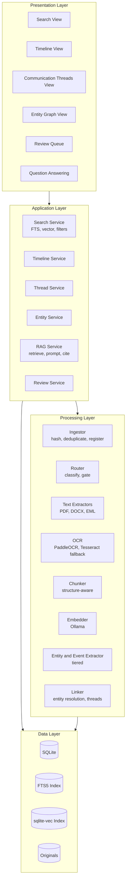

### 6.1 Component Responsibilities

| Component | Responsibility |
|-----------|----------------|
| **Ingestor** | Computes SHA-256, detects duplicates, records file metadata, registers the original |
| **Router** | Assigns a document class and processing route (Section 7.1); enforces cloud and exclusion rules |
| **Text Extractors** | Produce text with page and section structure from native text layers |
| **OCR** | Runs PaddleOCR on image-only pages and scans; falls back to Tesseract on failure; records OCR confidence |
| **Chunker** | Splits text into citable units using document structure; attaches page and position metadata |
| **Embedder** | Generates vectors via Ollama; records model name and version |
| **Entity and Event Extractor** | Proposes people, organisations, dates, and events, each with a supporting quotation; runs in tiers (Section 7.4) |
| **Linker** | Resolves entities across documents; reconstructs email threads |
| **Search Service** | Hybrid search combining FTS5, vector similarity, and structured filters, merged by reciprocal rank fusion |
| **Timeline Service** | Produces ordered event lists from confirmed events and communication sequences |
| **RAG Service** | Retrieves relevant chunks, builds a grounded prompt, and returns an answer with citations |
| **Review Service** | Maintains the queue of machine-proposed items awaiting confirmation |

---

## 7. Data Model

### 7.1 Conceptual Entity Relationships

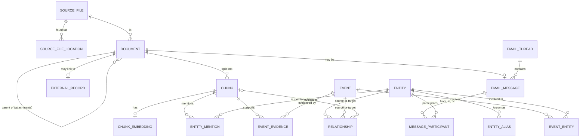

`CHUNK_EMBEDDING` and `chunk_fts` are virtual tables created in STORY-1.4 and are not part of migration `0001_initial.sql`.

### 7.2 Tables

| Table | Purpose | Principal Fields | Constraints |
|-------|---------|------------------|-------------|
| `source_file` | One row per unique file content | id, sha256, size_bytes, mime_type, imported_at | `sha256` unique |
| `source_file_location` | Each path at which a file was found | id, source_file_id, path, first_seen_at | `path` unique; cascades from `source_file` |
| `document` | Logical document (a PDF, a Word file, an email message, or an attachment) | id, source_file_id, parent_id, title, doc_class, processing_route, doc_date, low_confidence, created_at | `doc_class` and `processing_route` restricted to defined values; `parent_id` supports attachments |
| `external_record` | Pointer to a record held by another tool (e.g. bank statement categorisation) | id, document_id, external_system, external_id, summary_date_range | `(external_system, external_id)` unique |
| `chunk` | Citable text unit | id, document_id, ordinal, page_start, page_end, text, char_start, char_end, chunk_method, ocr_confidence | `(document_id, ordinal)` unique; `char_end >= char_start`; `ocr_confidence` between 0 and 1 |
| `chunk_embedding_<model>_<dimensions>` | One vec0 table per embedding model and dimension, e.g. chunk_embedding_bge_m3_1024 | chunk_id (primary key), embedding (fixed-length float vector) | A model or dimension change creates a new table rather than mixing incompatible vectors. |
| `chunk_fts` | Full-text index (FTS5, external-content) over chunk text, tokenized with unicode61 remove_diacritics 2 | | kept in sync with chunk by triggers on insert, update, and delete |
| `email_thread` | Conversation | id, subject_normalised, first_sent_at, last_sent_at | — |
| `email_message` | Individual message | id, document_id, thread_id, message_id_header, in_reply_to, sent_at, subject, thread_confidence | `document_id` unique; `message_id_header` unique; `thread_confidence` is `high` or `low` |
| `message_participant` | Sender and recipients of a message | message_id, entity_id, role | Primary key `(message_id, entity_id, role)`; role is `from`, `to`, or `cc` |
| `entity` | Person, organisation, place, or issue | id, entity_type, canonical_name, notes, created_at | `entity_type` restricted to defined values |
| `entity_alias` | Name variants | id, entity_id, alias, source_chunk_id | `(entity_id, alias)` unique |
| `entity_mention` | Occurrence of an entity in a chunk | id, entity_id, chunk_id, quote, confidence, status, created_at | `status` restricted; `confidence` between 0 and 1 |
| `event` | Something that occurred | id, title, description, event_date, date_precision, confidence, status, created_at | `date_precision` and `status` restricted |
| `event_evidence` | Links events to supporting chunks | event_id, chunk_id, quote | Primary key `(event_id, chunk_id)` |
| `event_entity` | Links events to involved entities | event_id, entity_id | Primary key `(event_id, entity_id)` |
| `relationship` | Typed edge between entities or events | id, source_type, source_id, target_type, target_id, relationship_type, confidence, status, evidence_chunk_id, created_at | `source_type` and `target_type` are `entity` or `event`; `status` restricted |
| `review_item` | Pending or decided machine suggestions | id, kind, payload, created_at, decided_at, decision | `kind` restricted; `decision` restricted |
| `processing_run` | Audit record of pipeline runs | id, stage, model_id, parameters, started_at, finished_at | — |
| `schema_migrations` | Applied migration versions | version, name, applied_at | Managed by the migration runner |
| `document_route_change` | Audit trail for every change to a document's processing route | id, document_id, from_route, to_route, change_kind, is_downgrade, risk_acknowledged, reason, changed_at | `change_kind` is `automatic` or `manual`; `from_route`/`to_route` restricted to the routes in Section 7.3.1 |

> `document` carries a partial unique index, `idx_document_source_top_level`, on `source_file_id` where `parent_id IS NULL`. This guarantees exactly one top-level document per source file; attachments and email messages are children via `parent_id` and are not constrained by this index (EPIC-5).

## 7.3 Enumerations

| Field | Allowed Values |
|-------|----------------|
| `document.doc_class` | `correspondence`, `court_filing`, `in_camera`, `financial_statement`, `receipt`, `other` |
| `document.processing_route` | `local_only`, `index_only`, `external`, `standard` (in order of restrictiveness; see below) |
| `document_route_change.change_kind` | `automatic`, `manual` |
| `entity.entity_type` | `person`, `organisation`, `place`, `issue` |
| `message_participant.role` | `from`, `to`, `cc` |
| `event.date_precision` | `exact`, `month`, `year`, `approximate`, `unknown` |
| `entity_mention.status`, `event.status`, `relationship.status` | `proposed`, `confirmed`, `edited`, `rejected` |
| `relationship.source_type`, `relationship.target_type` | `entity`, `event` |
| `email_message.thread_confidence` | `high`, `low` |
| `review_item.kind` | `entity_mention`, `event`, `alias`, `relationship`, `classification`, `ocr` |
| `review_item.decision` | `confirmed`, `edited`, `rejected` (or null while pending) |

### 7.3.1 Route Restrictiveness

Processing routes are ranked by restrictiveness, most restrictive first:

| Rank | Route | Meaning |
|------|-------|---------|
| 3 | `local_only` | Processed locally only; never sent to cloud services |
| 2 | `index_only` | Registered and searchable by metadata; not chunked or embedded |
| 1 | `external` | Handled by another tool; not chunked or embedded |
| 0 | `standard` | Processed normally; cloud services permitted if enabled |

**Rules:**

- **Source of truth.** The ranking is defined in code (`ROUTE_RESTRICTIVENESS` in `constants.py`). The set of valid routes is derived from it. It is not configurable, because it encodes the safety meaning of each route.
- **Duplicate content.** Where identical content is registered at several locations, the document takes the most restrictive route across them.
- **Automatic changes never downgrade.** Ingestion may only move a document to a more restrictive route.
- **Manual downgrades require acknowledgment.** A manual change to a less restrictive route requires explicit acknowledgment of the risk and is recorded in `document_route_change`.
- **Schema consistency.** The `CHECK` constraints on `document.processing_route` and `document_route_change` must list the same routes as the code. Tests in `tests/test_route_consistency.py` enforce this.

### 7.4 Design Notes

- **Join tables for participants and event entities.** `message_participant` supports the communication chain view (who sent or received each message). `event_entity` supports queries such as "all events involving this person".
- **Thread confidence.** Threads reconstructed from `In-Reply-To` and `References` headers are `high`. Threads inferred from subject and participants are `low` (STORY-5.6).
- **Date precision.** `date_precision` distinguishes exact dates from approximate descriptions. Legal timelines frequently require this distinction.
- **Status model.** Only `confirmed` items appear as facts in timeline views by default. The state transitions are defined in Section 8.14.
- **Polymorphic relationships.** `relationship.source_id` and `target_id` reference either `entity` or `event` depending on the type fields. SQLite cannot enforce a foreign key across two tables, so integrity for these rows is enforced by the application and checked by tests.
- **Cascades.** Deleting a `source_file` removes its locations and documents; deleting a document removes its chunks, message record, and external record. Deleting a chunk removes its entity mentions and event evidence.
- **Processing route and the database.** `processing_route` is stored on each document so that routing decisions remain auditable after the fact.
- **Audit.** `processing_run` records model identifiers and parameters so that results can be reproduced or regenerated.
- **Vector table naming.** The embedding model identifier is slugified and combined with the vector dimension to form the table name (vector_table_name()). This replaces the single-table-with-model_id-column design from v0.5, because sqlite-vec's vec0 tables are fixed-dimension and do not support a discriminator column cleanly.
- **No foreign key from vector tables to `chunk`**. Virtual tables cannot carry foreign keys. Deleting a chunk does not automatically remove its vectors; cleanup is an application responsibility, to be implemented alongside re-embedding (EPIC-4).
- **FTS5 sync.** Triggers on chunk keep chunk_fts current, including on cascade deletes from document or source file removal.
- **Document creation is idempotent per source file.** Re-ingesting a file updates its existing document rather than creating a duplicate, enforced by `idx_document_source_top_level`.
- **Duplicate content takes the most restrictive route.** Where identical content exists at several locations, the document's route is the most restrictive across all registrations seen so far (Section 7.3.1). Automatic ingestion only ever upgrades a document's route; it never downgrades one.
- **Title and class follow the most restrictive location.** When an automatic upgrade occurs, `doc_class` and `title` are replaced with the values from the registration that caused the upgrade. This keeps the displayed title and class consistent with the document's most restrictive known location, independent of the order in which files are ingested. A location that would downgrade the route leaves the title and class unchanged.
- **Manual route changes are separate from automatic ones.** A manual change (`change_route()`) can move a document to any route, including a downgrade, but a downgrade requires `risk_acknowledged=True` and is always recorded with `change_kind = 'manual'`. A manual change does not alter `doc_class` or `title`; only automatic upgrades do. If manual reclassification is added (STORY-2.5), it should apply the same title and class rule as automatic upgrades, so the two paths stay consistent.
- **Every route change is audited**, whether automatic or manual, in `document_route_change`, including the reason and whether a downgrade's risk was acknowledged.

---

## 8. Process Flows

### 8.1 Document Routing

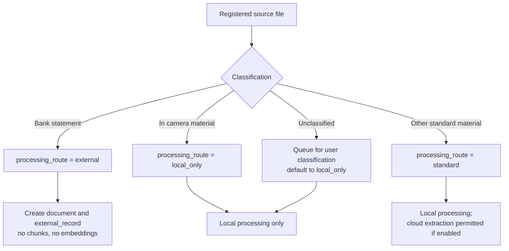

Routing is validated at startup: every doc_class must have a configured route, and in_camera is forced to local_only even if configured otherwise, with a warning logged.

**Classification rules:**

- **Bank statements** are identified by document class (assigned by filename pattern, folder, or user selection). They are registered for traceability and are excluded from chunking, embedding, and LLM extraction. Where useful, an `external_record` links to the output of the separate categorisation tool.
- **In camera material** is always processed locally. Cloud processing is disabled for this class regardless of global settings.
- **Unclassified documents** default to the most restrictive route until classified.

### Classification Convention

Document classes are assigned from each file's path relative to the `originals/` root. Rules are defined in `config.toml` under `[classification]`, evaluated in order, with the first match winning.

| Folder or pattern | Class | Route |
|-------------------|-------|-------|
| `in_camera/**` | `in_camera` | `local_only` |
| `**/bank_statement*` | `financial_statement` | `external` |
| `**/receipt*` | `receipt` | `standard` |
| `court_filings/**` | `court_filing` | `standard` |
| `correspondence/**` | `correspondence` | `standard` |
| (no match) | `other` (default) | `local_only` |

**Dependency on folder structure:** classification is only as reliable as the folder layout. The system does not infer class from document content. Documents placed outside the expected folders fall to `other` and route to `local_only`, which is a safe default but may not reflect their actual nature. STORY-2.5 provides a review path for these.

**Matching rules:**

- Patterns are gitignore-style globs (`**`, `*`) matched against the relative path
- Matching is case-insensitive; patterns should be written in lowercase
- Rule order matters: more specific rules precede general ones

### 8.2 Ingestion Pipeline

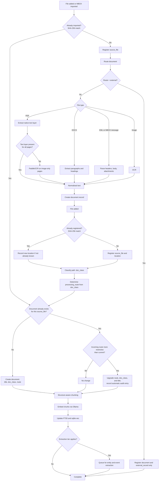

**Notes:**

- Classification requires the file to be located beneath the configured originals root; a path outside it cannot be classified and is rejected before registration proceeds.
- Per-file failures (I/O errors, database errors) are caught and logged individually; a single failing file does not stop the rest of the run.
- Chunking, embedding, and extraction are not yet wired into this pipeline; they begin in EPIC-4. `external` and `index_only` routed documents are expected to bypass these steps entirely once implemented.

### 8.2.1 Ingestion CLI

Ingestion is run via `python -m document_store.ingest [path]`, which:

1. Loads configuration and builds the classifier and router, failing fast on misconfiguration.
2. Validates that the target path is inside the originals root.
3. Runs the pipeline above over every supported file beneath the path.
4. Reports counts of documents created, existing, and upgraded, plus skipped and failed files.
5. Exits non-zero if any file failed, or if configuration or path validation failed.

### 8.3 OCR Flow

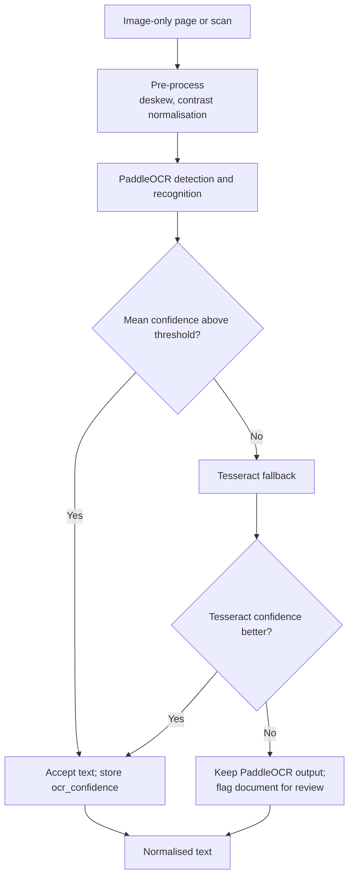

Pre-processing improves results on low-quality scans. Low-confidence pages are flagged so that the user can verify key passages against the image.

### 8.4 Chunking Strategy

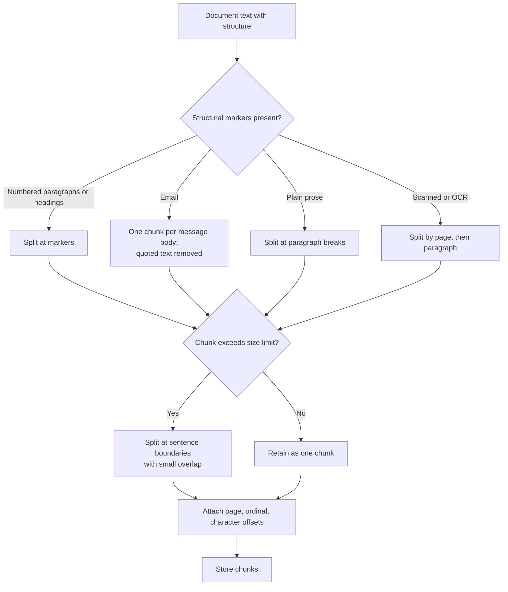

**Notes:**

- Quoted reply text is removed from email bodies before chunking. The quoted text remains available in the source file.
- Each chunk retains character offsets so the interface can highlight the exact passage in the original.
- Chunks from low-confidence OCR carry `ocr_confidence` so that search results can indicate reliability.

### 8.5 Embedding Generation

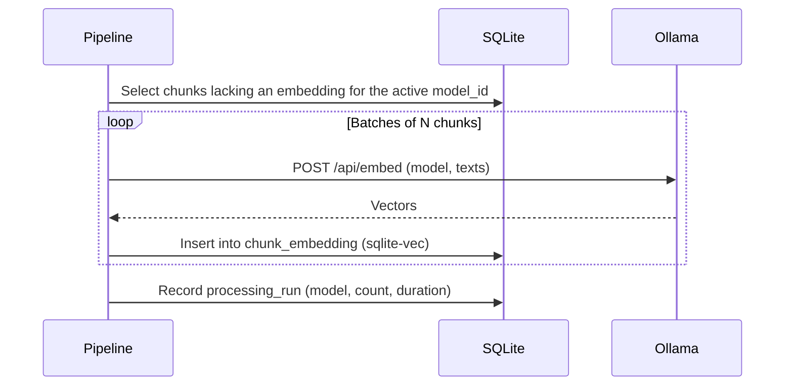

Each embedding stores its model identifier. Changing models creates a second embedding set rather than overwriting the first. Search uses one active model at a time.

### 8.6 Entity and Event Extraction (Tiered)

Extraction is resource-intensive on this hardware, so it runs in tiers.

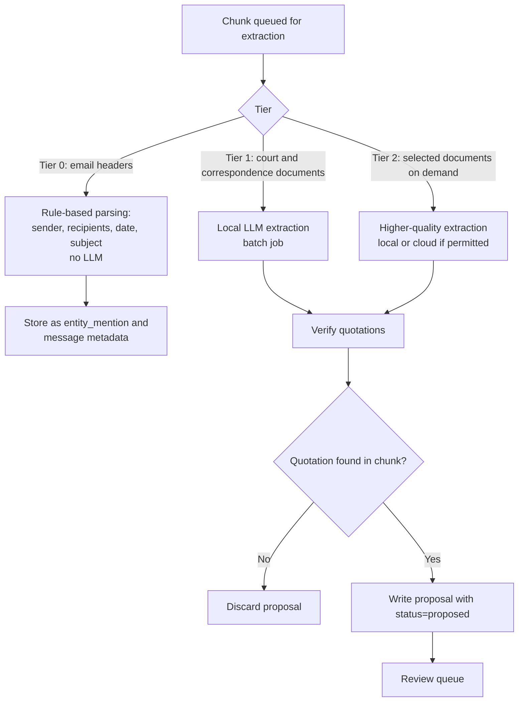

**Tier definitions:**

| Tier | Material | Method | Timing |
|------|----------|--------|--------|
| 0 | Email headers and participants | Rule-based parsing | During ingestion |
| 1 | Court documents and correspondence | Local LLM batch extraction | Overnight batch |
| 2 | Selected documents | Higher-quality extraction on demand | Interactive, per document |

**Verification step:** Confirming that each quotation appears verbatim in the source chunk is an inexpensive and effective guard against invented facts.

**Restriction:** `local_only` documents are never sent to cloud extraction, including Tier 2.

### 8.7 Entity Resolution

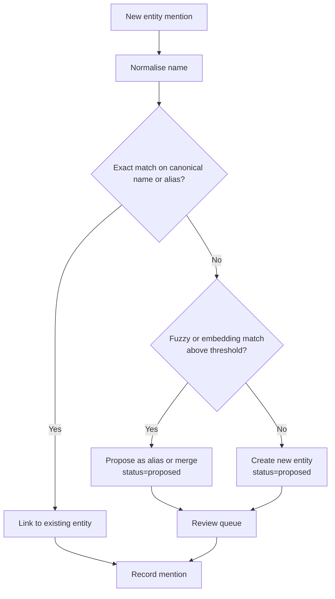

Merging entities is never automatic. Two individuals sharing a name may be distinct persons, which is materially significant in litigation.

### 8.8 Email Processing

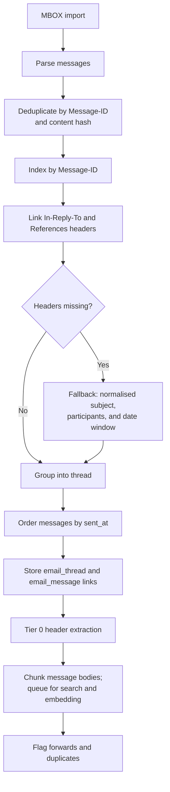

Several thousand emails are expected to contain substantial duplication (quoted replies, forwards, multiple copies across labels). Deduplication occurs before embedding to limit processing time and noise in search results. Gmail Takeout generally preserves threading headers, so threads are usually reliable; the subject-based fallback is assigned lower confidence.

### 8.9 Timeline Generation

Timelines draw on two sources: **events** (occurrences that have been extracted and confirmed) and **communications** (messages sent, treated as events in their own right).

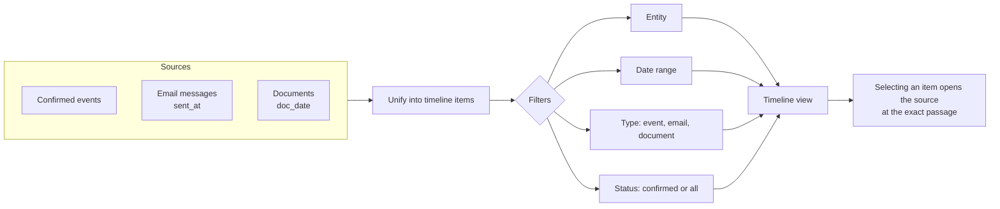

Date precision is displayed visually: exact dates render as points, approximate dates as bands, and undated items in a separate lane.

### 8.10 Communication Chain View

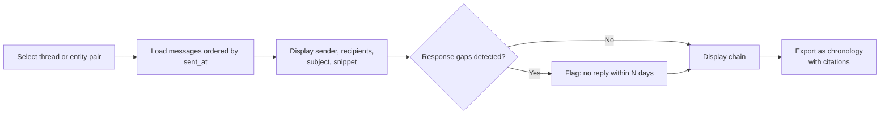

### 8.11 Hybrid Search Flow

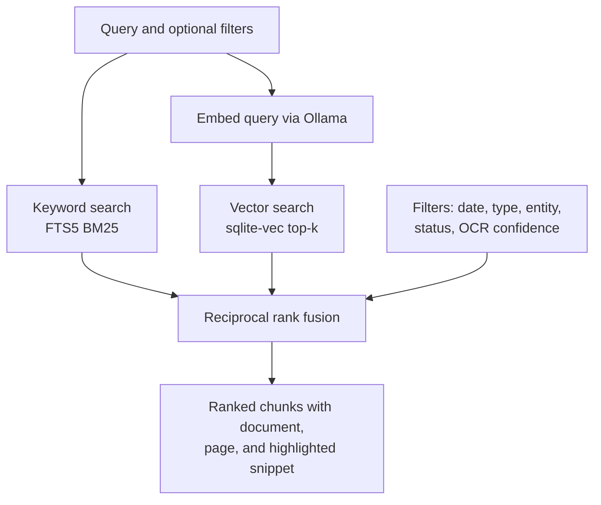

### 8.12 Question Answering (RAG) Flow

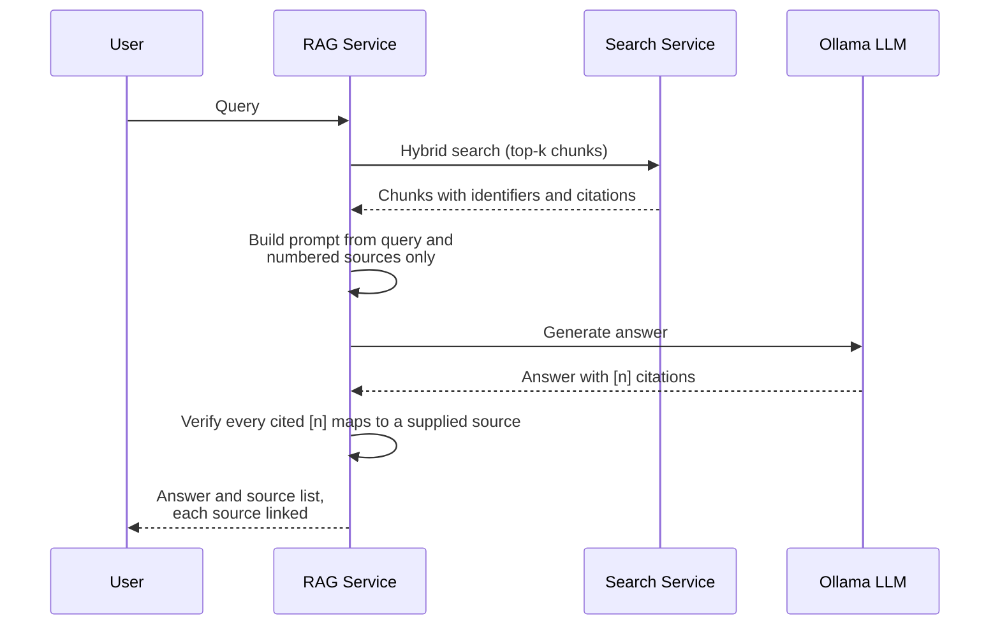

**Guardrails:**

- The model answers only from supplied sources and returns "not found in the documents" where sources are insufficient.
- Citation markers that do not map to a supplied source are removed or flagged.
- The interface always displays retrieved sources.
- Question answering uses the local model by default. Cloud generation is subject to the same route restrictions as extraction.

### 8.13 Image Handling

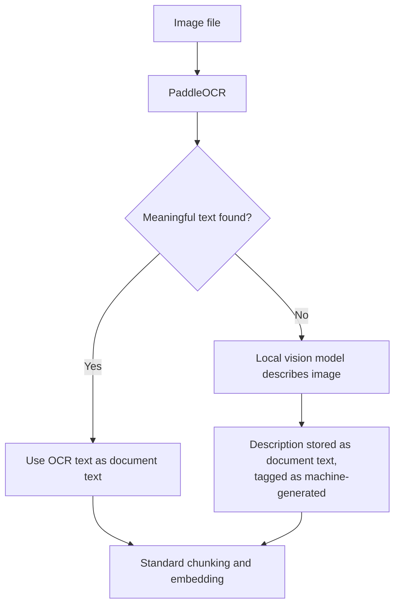

Receipts and similar items are handled through OCR first. Key-value extraction on receipts runs on OCR text, which is expected to improve results compared with the earlier image-based approach.

### 8.14 Review Workflow

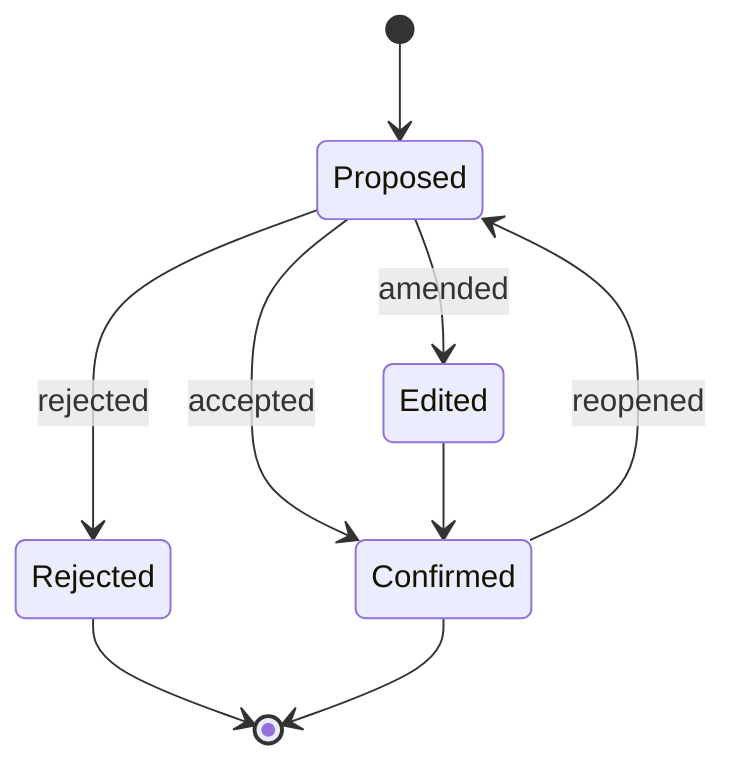

---

## 9. Feature Views

### 9.1 Timeline

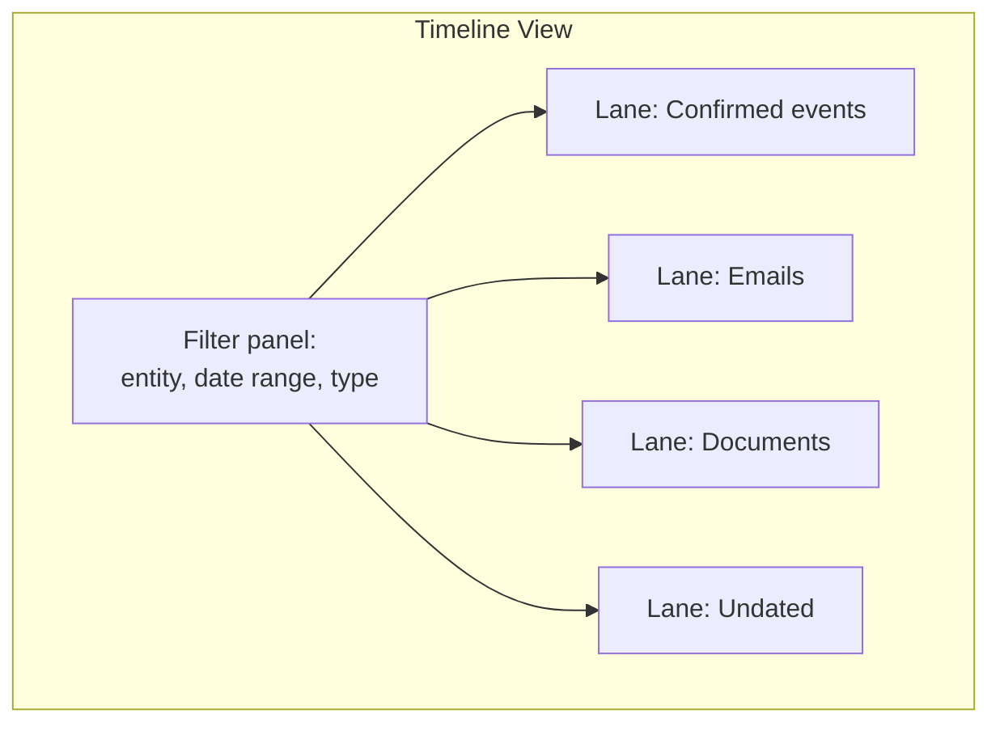

### 9.2 Entity Graph

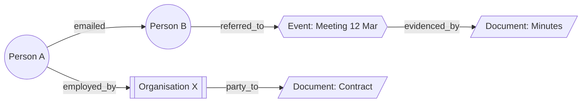

Graph views derive from the `relationship` table and are filtered to confirmed items by default.

---

## 10. Deployment and File Layout

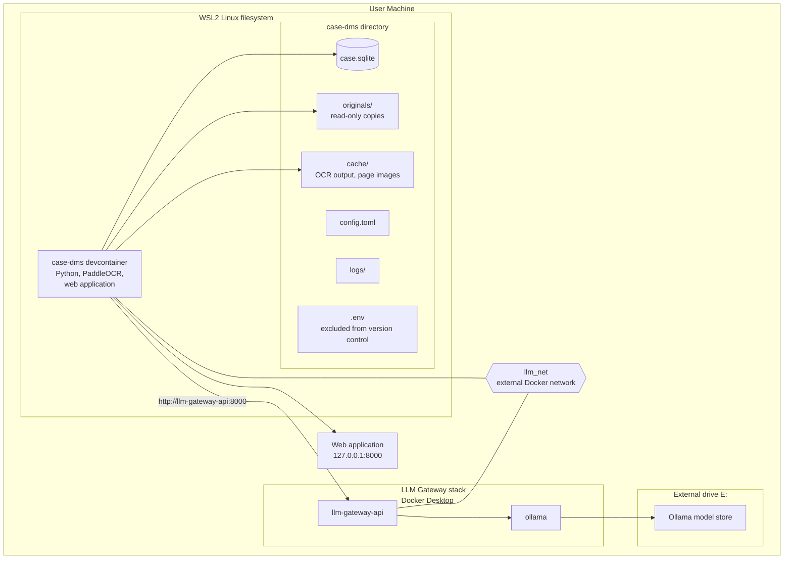

### 10.1 File Layout

| Path | Contents | Backup |
|------|----------|--------|
| `case.sqlite` | Metadata, FTS index, vectors, review state | Daily |
| `originals/` | Copies of source files | Once, plus on change |
| `cache/` | Regenerable OCR output and page images | Not required |
| `logs/` | Pipeline and audit logs | Optional |
| `config.toml` | Model names, chunk sizes, routing rules, gateway URL, paths | Yes |
| `.env` | `LLM_GATEWAY_KEY` and other secrets | Yes, stored separately from project backup |
| E: `models/` | Ollama model files (managed by the gateway stack) | Not required (re-downloadable) |

### 10.2 Configuration and Secrets

| Setting | Location | Example | Notes |
|---------|----------|---------|-------|
| `LLM_GATEWAY_URL` | Container environment | `http://llm-gateway-api:8000` | Internal to `llm_net` |
| `LLM_GATEWAY_KEY` | `.env` or host environment | (secret) | Never committed; never written to `config.toml` |
| `LLM_CLIENT_NAME` | Container environment | `case-dms` | Used in gateway logs via `x-client-name` |
| Embedding model | `config.toml` | `bge-m3` | Must appear in gateway `ALLOWED_EMBED_MODELS` |
| Extraction model | `config.toml` | `qwen2.5:7b-instruct` | Must appear in gateway `ALLOWED_MODELS` |
| Generation model | `config.toml` | `qwen2.5:7b-instruct` | Must appear in gateway `ALLOWED_MODELS` |
| embedding_dimensions | `config.toml` | 1024 | |

### 10.3 Storage Notes

- The SQLite database and vector index reside on the WSL Linux filesystem. Placing them on `/mnt/c` or `/mnt/e` is avoided because of file-locking reliability and latency.
- Ollama model weights remain on E: and are mounted by the gateway stack using long-form bind syntax (see gateway documentation).
- The originals folder is accessible from Windows via `\\wsl$`.

### 10.4 Startup Order

```mermaid
sequenceDiagram
    participant Op as Operator
    participant GW as LLM Gateway stack
    participant Net as llm_net
    participant Dev as case-dms devcontainer
    Op->>Net: docker network create llm_net (once)
    Op->>GW: docker compose up -d --build
    Op->>Dev: Reopen project in container
    Dev->>GW: GET /health
    GW-->>Dev: {"status": "ok"}
    Dev->>GW: POST /embed (smoke test)
    GW-->>Dev: Embeddings returned
```

The startup check in the devcontainer confirms that both health and embedding endpoints are reachable before any processing begins.

### 10.5 Originals Folder Convention

The `originals/` folder is organised by document class. The structure below is required for the default classification rules to work as intended.

```
originals/
├── in_camera/            # in camera material (local processing only)
├── court_filings/        # filed or served court documents
├── correspondence/       # letters and other correspondence
└── (other folders)      # any other material; classified as "other"
```

Bank statements and receipts are matched by filename pattern (`bank_statement*`, `receipt*`) and may sit in any folder beneath `originals/`.

Email (MBOX) imports are handled as a separate ingestion path (EPIC-5) and are not subject to this folder convention; their classification is assigned at import.

**Rationale:** folder-based classification is simple to inspect and to correct manually, and it keeps the classification decision visible in the filesystem. Changing rules requires editing `config.toml`, not code.

---

## 11. Security and Privacy

| Risk | Mitigation |
|------|-----------|
| Exposure on a network | Web application bound to `127.0.0.1` only |
| Data leaving the machine | Local models by default; cloud calls gated by document class and logged |
| In camera material exposed to cloud services | `local_only` route; cloud disabled for this class regardless of settings |
| Misclassification of in camera material | Unclassified documents default to `local_only`; classification is reviewable |
| Data loss | Automated backups of database and originals, with periodic restore testing |
| Tampering with originals | Checksums stored; periodic re-verification |
| Model changes altering results | Model identifiers and versions recorded per processing run |
| Over-reliance on machine output | Review queue; citations on every answer; confirmed and proposed states distinguished |
| Disk encryption | Full-disk encryption on the internal drive; external drive encrypted if it holds case data |
| Court restrictions on in camera material | Confirm the applicable restrictions before ingestion; storage location and access to be reviewed accordingly |

---

## 12. Quality Assurance

An evaluation set guards against silent degradation.

```mermaid
flowchart LR
    A[Curate 30 to 50 queries<br/>with known answer passages] --> B[Run search]
    B --> C{Correct passage in top 5?}
    C -- Yes --> D[Pass]
    C -- No --> E[Investigate chunking,<br/>model, or query]
    A --> F[Run extraction on sample documents]
    F --> G[Compare with hand-labelled events]
    A --> H[OCR benchmark on sample scans]
    H --> I[Compare PaddleOCR and Tesseract<br/>against transcribed text]
```

The evaluation is repeated whenever the embedding model, OCR engine, chunker, or extraction prompt changes. It also determines whether the local models meet requirements or whether hosted models should be considered for non-restricted material.

---

## 13. Risks and Open Items

| Item | Type | Notes |
|------|------|-------|
| Local embedding quality relative to hosted models | Risk | Resolved through the evaluation set (Section 12) |
| OCR quality on degraded scans | Risk | PaddleOCR with pre-processing; confidence flagging; benchmark |
| CPU throughput for batch extraction | Risk | Tiered extraction; overnight batch; smaller model if needed |
| LLM extraction accuracy on legal text | Risk | Quotation verification and review queue |
| Entity misidentification (same name, different persons) | Risk | No automatic merging; alias proposals only |
| GPU memory (4 GB) limits model size | Constraint | CPU inference for larger models; GPU for small models |
| Court restrictions on storing disclosed or in camera material | Open | Confirm before ingestion; may affect storage location and encryption |
| Bank statement tool interoperability | Open | Define the form of the `external_record` link |
| Handling of privileged material | Open | Determine whether privileged items are tagged and excluded from cloud features |
| Adoption of Kuzu | Open | Reassess if multi-hop queries become common |
| Export formats for legal advisers | Open | Likely PDF chronologies and CSV |
| PaddlePaddle 3.3.1 oneDNN bug on CPU detection model | Known issue | Worked around by disabling `enable_mkldnn`; re-test when paddlepaddle is upgraded; track for removal of the workaround |

---

## 14. Build Sequence

```mermaid
gantt
    title Build phases
    dateFormat  YYYY-MM-DD
    axisFormat  %b
    section Foundation
    Schema, ingestion, routing             :a1, 2025-01-01, 14d
    Text extraction (PDF, DOCX, EML)       :a2, after a1, 14d
    OCR pipeline (PaddleOCR)               :a3, after a2, 10d
    section Search
    Chunking, FTS5, embeddings, sqlite-vec :b1, after a3, 14d
    Hybrid search interface                :b2, after b1, 7d
    section Structure
    Email processing and threads           :c1, after b2, 10d
    Entity and event extraction and review :c2, after c1, 21d
    Timeline view                          :c3, after c2, 14d
    section Advanced
    Entity graph view                      :d1, after c3, 14d
    RAG question answering with citations  :d2, after d1, 14d
    Evaluation harness                     :d3, after b1, 7d
```

(Dates are placeholders; the diagram defines sequence only.)

**Sequencing rationale:** Routing precedes all processing so that restricted material is handled correctly from the first ingestion. OCR quality is established before chunking and embedding, because downstream search and extraction depend on it. Question answering is developed last because its quality is bounded by the retrieval beneath it.

---

## Change Log

| Version | Section | Change |
|---------|---------|--------|
| v0.3 | 7 | Initial data model |
| v0.4 | 5, 10 | Gateway integration |
| v0.5 | 7 | Added `message_participant`, `event_entity`, `source_file_location`, `schema_migrations`; defined enumerations and constraints; specified `review_item.kind` values and `email_message.thread_confidence` |
| v0.7 | 8.1, 10.5 | Documented classification convention and originals folder structure |
| v0.8 | 7.3, 7.3.1 | Route restrictiveness defined in code; enumerations listed with rules for duplicate handling and downgrades |
| v0.9 | 7.2, 7.4, 8.2 | Added `document_route_change` table and unique index note; documented title/class-follows-most-restrictive rule; updated ingestion pipeline diagram and added CLI description |
