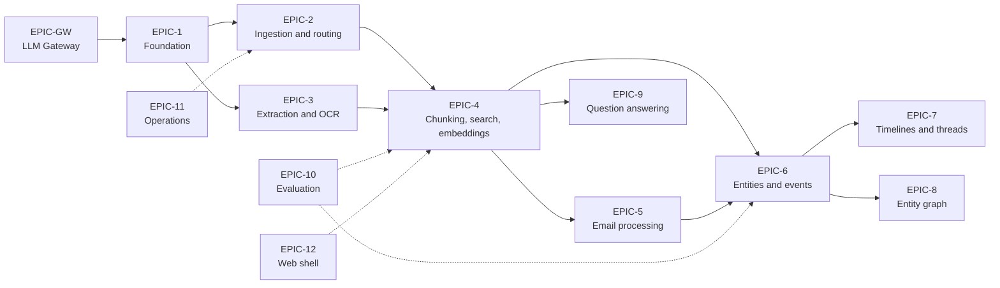
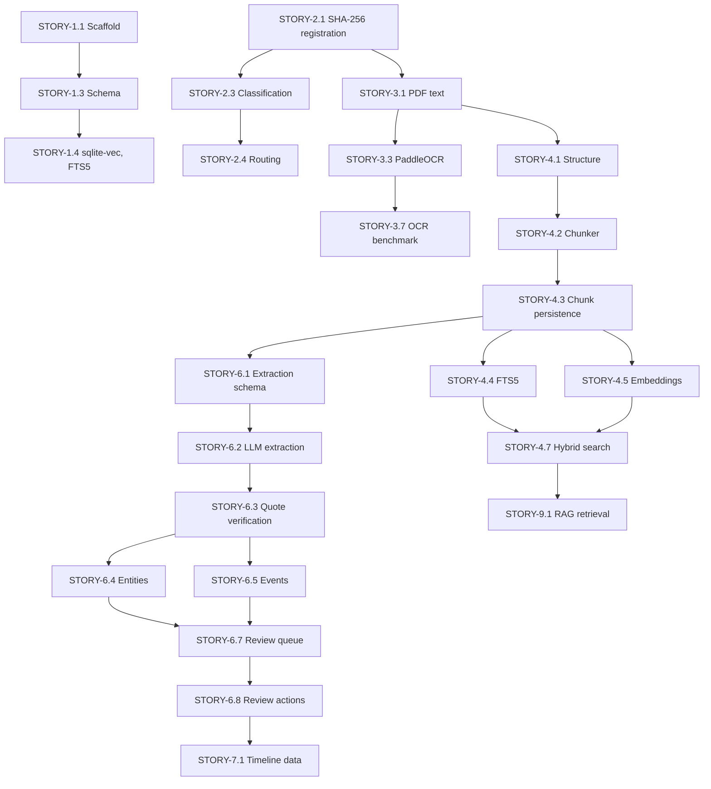

# Case Document Management System: Initial Backlog

**Status:** Draft v0.2
**Source:** Architecture Document v0.4
**Scope:** Initial backlog covering the foundation through to question answering.

---

## 1. Conventions

| Field | Meaning |
|-------|---------|
| **ID** | `EPIC-n` for epics; `STORY-n.m` for stories; `TASK-n.m.k` for tasks where decomposition is needed |
| **Priority** | `P0` blocking; `P1` required for the phase; `P2` desirable; `P3` later or optional |
| **Estimate** | Relative size: `S` (under 1 day), `M` (1 to 3 days), `L` (3 to 7 days), `XL` (over 1 week). Estimates assume part-time effort and are to be validated after the first sprint |
| **Status** | `Not started`, `In progress`, `Blocked`, `Done` |
| **Depends on** | IDs that must be complete before the item can start |

Each story carries acceptance criteria. A story is complete only when all criteria are met and verified.

---

## 2. Epic Overview

| ID | Epic | Purpose | Phase |
|----|------|---------|-------|
| EPIC-1 | Project foundation | Repository, configuration, schema, and migrations | 0 |
| EPIC-2 | Ingestion and routing | File registration, classification, and deduplication | 1 |
| EPIC-3 | Text extraction and OCR | Native text, Word, email, and PaddleOCR processing | 1 |
| EPIC-4 | Chunking, search, and embeddings | Chunks, FTS5, vectors, and hybrid search | 2 |
| EPIC-5 | Email processing | Message parsing, threading, and header extraction | 3 |
| EPIC-6 | Entities and events | Tiered extraction, verification, entity resolution, review | 3 |
| EPIC-7 | Timelines and communication views | Timeline and thread views | 4 |
| EPIC-8 | Entity graph | Relationship views | 5 |
| EPIC-9 | Question answering | RAG with citations | 5 |
| EPIC-10 | Evaluation and quality | Benchmarks, evaluation harness, regression checks | Cross-cutting |
| EPIC-11 | Operations | Backup, restore, integrity checks, logging | Cross-cutting |
| EPIC-12 | Web application shell | Local UI framework and navigation | 2 onward |
| EPIC-GW | LLM Gateway | Close functionality gaps and integrate into this tool | 0 |



---

## 3. Phase 0: Project Foundation

### EPIC-1: Project Foundation

| ID | Story | Priority | Estimate | Depends on |
|----|-------|----------|----------|-----------|
| STORY-1.1 | Repository scaffold and environment | P0 | M | — |
| STORY-1.2 | Configuration file and paths | P0 | S | STORY-1.1 |
| STORY-1.3 | Database schema v1 as migrations | P0 | M | STORY-1.1 |
| STORY-1.4 | sqlite-vec and FTS5 loading | P0 | S | STORY-1.3 |
| STORY-1.5 | Ollama connectivity check | P1 | S | STORY-1.2 |
| STORY-1.6 | PaddleOCR connectivity check | P1 | S | STORY-1.2 |
| STORY-1.7 | Test harness and fixtures | P1 | S | STORY-1.1 |
| STORY-1.8 | Gateway client module for case-dms | P0 | M | EPIC-GW |
| STORY-1.9 | Shared Docker network and devcontainer config | P0 | S | EPIC-GW |

**STORY-1.1: Repository scaffold and environment**

- Devcontainer definition (Dockerfile, devcontainer.json)
- Ollama host networking verified from container
- Project stored on WSL filesystem. Documented
- Python 3.11+ project with dependency management, linting, and a test runner
- Environment reproducible from a lock file
- README describes setup steps

*Acceptance criteria:*
- [x] A fresh clone installs with a single documented command
- [x] Isolated test environment builds on multiple systems with no issues
- [x] Tests run (zero tests acceptable at this point) and pass
- [x] Linting runs without errors

**STORY-1.2: Configuration file and paths**

- `config.toml` holds paths, model names, chunk sizes, routing rules, and OCR thresholds
- Paths are resolved relative to the project directory on the internal drive
- The Ollama model directory is read from `OLLAMA_MODELS` and is not hard-coded

*Acceptance criteria:*
- [x] Missing or malformed config produces a clear error message
- [x] Changing a setting does not require code changes
- [x] Paths on the external drive (E:) are accepted for models but not for the database

**STORY-1.3: Database schema v1 as migrations**

- Tables from Architecture Section 7.2 created through versioned migrations
- Migration tool records the applied version
- Indexes on `document.doc_class`, `document.doc_date`, `chunk.document_id`, `email_message.sent_at`, `entity_mention.entity_id`, `event.event_date`

*Acceptance criteria:*
- [x] Migrations apply to an empty database
- [x] Migrations are idempotent when re-run
- [x] A schema diagram or dump is generated and committed

**STORY-1.4: sqlite-vec and FTS5 loading**

- sqlite-vec extension loads on connection
- The `chunk_embedding` virtual table is created with dimension set from config
- FTS5 table `chunk_fts` is created and kept in sync by triggers or application code

*Acceptance criteria:*
- [x] A test inserts a vector and retrieves it by nearest-neighbour query
- [x] A test inserts text and retrieves it by keyword query
- [x] Changing embedding dimension in config produces a new table rather than silently failing

**STORY-1.5: Ollama connectivity check**

- Health check confirms the service is reachable and lists installed models
- Reports a clear error if the configured embedding or LLM model is missing

*Acceptance criteria:*
- [x] Command returns model list and status
- [x] Missing model produces an actionable message (`ollama pull <name>`)

**STORY-1.6: PaddleOCR connectivity check**

- Confirms PaddleOCR runs on a sample image and returns text with confidence values
- Reports CPU or GPU mode

*Acceptance criteria:*
- [x] Sample image OCR completes and returns text
- [x] Confidence values are present in the output
- [x] Reports CPU or GPU mode

**STORY-1.7: Test harness and fixtures**

- Fixture set of small sample files: one native PDF, one scanned PDF, one DOCX, one EML, one image
- Fixtures contain no real case material

*Acceptance criteria:*
- [x] Fixtures exist and are documented
- [x] Test suite runs against fixtures

### EPIC-GW: LLM Gateway

**GW-1: Add POST /embed with allowlist and batch limits**

**GW-2: Configurable timeout**

**GW-3: GPU request serialisation**

**GW-4: Verify logs contain no prompt text**

---

## 4. Phase 1: Ingestion, Routing, and Extraction

### EPIC-2: Ingestion and Routing

| ID | Story | Priority | Estimate | Depends on |
|----|-------|----------|----------|-----------|
| STORY-2.1 | File registration with SHA-256 | P0 | S | STORY-1.3 |
| STORY-2.2 | Duplicate detection | P0 | S | STORY-2.1 |
| STORY-2.3 | Document classification rules | P0 | M | STORY-1.2, STORY-2.1 |
| STORY-2.3a | Document the originals folder convention (architecture and README) | P1 | S | |
| STORY-2.4 | Routing engine | P0 | M | STORY-2.3 |
| STORY-2.5 | Classification review for unclassified documents | P1 | S | STORY-2.4 |
| STORY-2.6 | Ingestion CLI | P1 | S | STORY-2.1 to STORY-2.4 |
| STORY-2.7 | Ingestion run log | P2 | S | STORY-2.6 |
| STORY-2.8 | Document record creation (route-aware, idempotent) | P0 | M | STORY-2.1, STORY-2.4 |

**STORY-2.1: File registration with SHA-256**

- Walks a folder or accepts a file path
- Computes SHA-256, size, and MIME type
- Creates a `source_file` record; does not copy or modify the original

*Acceptance criteria:*
- [x] Re-registering an unchanged file creates no new record
- [x] Original file hash is unchanged after registration
- [x] Files with unsupported types are logged and skipped

**STORY-2.2: Duplicate detection**

- Files with identical SHA-256 are linked to the existing `source_file`, not duplicated
- Duplicate paths are recorded as additional locations

*Acceptance criteria:*
- [x] Two identical files in different folders produce one `source_file` and two location records
- [x] Duplicate report can be generated

**STORY-2.3: Document classification rules**

- Rules assign `doc_class` from filename pattern, folder, or explicit metadata
- Supported classes: `correspondence`, `court_filing`, `in_camera`, `financial_statement`, `receipt`, `other`
- Rules are defined in config, not code

*Acceptance criteria:*
- [ ] Bank statement files are classified as `financial_statement` by configured pattern
- [ ] In camera material classified by configured folder or pattern
- [ ] Rules are testable with fixture filenames

**STORY-2.4: Routing engine**

- Maps `doc_class` to `processing_route` (`standard`, `local_only`, `index_only`, `external`)
- Unclassified documents default to `local_only`
- Cloud eligibility is determined solely by route

*Acceptance criteria:*
- [x] `in_camera` always routes to `local_only`
- [x] `financial_statement` routes to `external`
- [x] Unclassified documents route to `local_only`
- [x] A unit test covers every class-to-route mapping

**STORY-2.5: Classification review for unclassified documents**

- Review list of documents with `other` or unclassified status
- User can assign a class; assignment is recorded

*Acceptance criteria:*
- [x] Unclassified documents appear in the list
- [x] Reclassification updates route and is logged
- [x] `unclassified` default class with `local_only` status

**STORY-2.6: Ingestion CLI**

- Command to ingest a folder: `ingest <path>`
- Reports counts: new, duplicate, skipped, routed by class

*Acceptance criteria:*
- [x] Command runs on a folder of fixtures and prints a summary
- [x] Exit code non-zero on fatal error

**STORY-2.7: Ingestion run log**

- Each run recorded in `processing_run`
- Log file in `logs/`

*Acceptance criteria:*
- [x] Run records start and end time, counts, and parameters

**STORY-2.8: Document record creation**

*Acceptance criteria:*

- [x] Registering a file with a supported type creates exactly one top-level `document` row for its `source_file`
- [x] Re-running creates no duplicate documents
- [x] A file present at multiple paths takes the most restrictive route across all locations, and the document row is updated if a later location is more restrictive
- [ ] `financial_statement` documents create a `document` row and an `external_record` row, and no chunks
- [x] `doc_class` and `processing_route` are stored on the document
- [x] The document row's `title` defaults to the file name

*Schema change required:* a partial unique index so one top-level document exists per source file:

```sql
CREATE UNIQUE INDEX idx_document_source_top_level
    ON document(source_file_id)
    WHERE parent_id IS NULL;
```

### EPIC-3: Text Extraction and OCR

| ID | Story | Priority | Estimate | Depends on |
|----|-------|----------|----------|-----------|
| STORY-3.1 | Native PDF text extraction | P0 | M | STORY-2.1 |
| STORY-3.2 | Image-only page detection | P0 | S | STORY-3.1 |
| STORY-3.3 | PaddleOCR integration | P0 | M | STORY-1.6, STORY-3.2 |
| STORY-3.4 | Image pre-processing | P1 | M | STORY-3.3 |
| STORY-3.5 | Tesseract fallback | P1 | S | STORY-3.3 |
| STORY-3.6 | DOCX extraction | P0 | S | STORY-2.1 |
| STORY-3.7 | OCR benchmark | P1 | M | STORY-3.3, STORY-3.5 |
| STORY-3.8 | Image file handling | P1 | S | STORY-3.3 |
| STORY-3.9 | Low-confidence flagging | P1 | S | STORY-3.3 |

**STORY-3.1: Native PDF text extraction**

- Extracts text with page numbers using `pymupdf`
- Records page count and whether each page has a text layer

*Acceptance criteria:*
- [x] Native fixture PDF returns text for each page with correct page numbers
- [x] Page-level text-layer status is recorded

**STORY-3.2: Image-only page detection**

- Pages with no or negligible text layer are marked for OCR
- Threshold configurable

*Acceptance criteria:*
- [x] Scanned fixture PDF identifies all pages as image-only
- [x] Native fixture PDF identifies none
- [x] Character threshold for ocr requirement set in config and passed to extract_pdf()

**STORY-3.3: PaddleOCR integration**

- Runs PaddleOCR on image-only pages and image files
- Returns text, page, and mean confidence
- Results cached in `cache/` to avoid reprocessing

*Acceptance criteria:*
- [x] Scanned fixture produces text with confidence
- [x] Re-running uses cache and does not re-run OCR
- [x] OCR output is stored per page

**STORY-3.4: Image pre-processing**

- Deskew, contrast normalisation, and optional binarisation before OCR
- Each step configurable and can be disabled

*Acceptance criteria:*
- [ ] Pre-processing is applied to low-quality fixture scans
- [ ] Benchmark shows no degradation on clean fixtures (see STORY-3.7)

**STORY-3.5: Tesseract fallback**

- Invoked only when PaddleOCR mean confidence is below threshold
- The higher-confidence result is kept

*Acceptance criteria:*
- [x] Fallback triggers on a low-confidence fixture
- [x] Fallback does not trigger on high-confidence fixtures

**STORY-3.6: DOCX extraction**

- Extracts paragraphs, headings, and tables with structure markers
- Page numbers are approximated where Word does not store them; this is recorded

*Acceptance criteria:*
- [x] DOCX fixture yields paragraphs and headings in order
- [x] Tables are extracted as text with row and column markers

**STORY-3.7: OCR benchmark**

- Benchmark on 20 to 30 low-quality scans with transcribed ground truth
- Compares PaddleOCR and Tesseract on character error rate
- Results recorded in the evaluation log

*Acceptance criteria:*
- [x] Benchmark script runs reproducibly
- [ ] Character error rate reported for each engine and for each pre-processing setting
- [ ] Decision on default OCR configuration recorded

**STORY-3.8: Image file handling**

- Standalone images (receipts, photographs) processed through OCR
- Images with no meaningful text are flagged for vision description (deferred to EPIC-6 or later)

*Acceptance criteria:*
- [ ] Receipt fixture produces OCR text
- [ ] Images with no text are flagged

**STORY-3.9: Low-confidence flagging**

- Documents and pages below OCR confidence threshold flagged for review
- Flag visible in the document record

*Acceptance criteria:*
- [ ] Low-confidence fixture appears in the flagged list
- [ ] Flag clears on manual review

---

## 5. Phase 2: Chunking, Search, and Embeddings

### EPIC-4: Chunking, Search, and Embeddings

| ID | Story | Priority | Estimate | Depends on |
|----|-------|----------|----------|-----------|
| STORY-4.1 | Structure detection | P0 | M | STORY-3.1, STORY-3.6 |
| STORY-4.2 | Structure-aware chunker | P0 | L | STORY-4.1 |
| STORY-4.3 | Chunk persistence and offsets | P0 | S | STORY-4.2, STORY-1.4 |
| STORY-4.4 | FTS5 indexing | P0 | S | STORY-4.3 |
| STORY-4.5 | Embedding generation via Ollama | P0 | M | STORY-4.3, STORY-1.5 |
| STORY-4.6 | Embedding model comparison | P1 | M | STORY-4.5 |
| STORY-4.7 | Hybrid search service | P0 | M | STORY-4.4, STORY-4.5 |
| STORY-4.8 | Search filters | P1 | M | STORY-4.7 |
| STORY-4.9 | Search interface (minimal) | P1 | M | STORY-4.7, STORY-12.1 |
| STORY-4.10 | Excluded-route enforcement in chunking | P0 | S | STORY-2.4, STORY-4.2 |

**STORY-4.1: Structure detection**

- Detects numbered paragraphs, headings, page breaks, and email bodies
- Output is a structure map used by the chunker

*Acceptance criteria:*
- [ ] Fixture with numbered paragraphs yields correct paragraph numbers
- [ ] Fixture with headings yields heading hierarchy

**STORY-4.2: Structure-aware chunker**

- Splits at structural markers; applies sentence-level splitting with overlap when a chunk exceeds the size limit
- Deterministic: same input produces same chunks

*Acceptance criteria:*
- [ ] Re-running on the same input produces byte-identical chunk output
- [ ] No chunk exceeds configured maximum size except where a single sentence does
- [ ] Chunks retain page start and end

**STORY-4.3: Chunk persistence and offsets**

- Chunks stored with `ordinal`, page range, character offsets, and `chunk_method`
- Offsets allow highlighting in the source

*Acceptance criteria:*
- [ ] Stored text at character offsets matches chunk text
- [ ] Ordinal is contiguous per document

**STORY-4.4: FTS5 indexing**

- Every chunk indexed in `chunk_fts`
- Index updated on insert and on chunk deletion

*Acceptance criteria:*
- [ ] Exact-phrase query returns expected chunk
- [ ] Name with punctuation is searchable

**STORY-4.5: Embedding generation via Ollama**

- Batched calls to `/api/embed`
- Writes to `chunk_embedding` with model identifier
- Skips chunks already embedded for the active model

*Acceptance criteria:*
- [ ] All chunks in a fixture document receive an embedding
- [ ] Re-running creates no duplicate embeddings
- [ ] `processing_run` records model, count, and duration

**STORY-4.6: Embedding model comparison**

- Evaluate `bge-m3` and `nomic-embed-text` on the evaluation query set (EPIC-10)
- Record throughput on CPU and retrieval results

*Acceptance criteria:*
- [ ] Comparison report produced with retrieval results and timing
- [ ] Default embedding model selected and recorded in config

**STORY-4.7: Hybrid search service**

- Combines FTS5 BM25 and vector top-k using reciprocal rank fusion
- Returns chunk, document, page, and highlighted snippet

*Acceptance criteria:*
- [ ] Query returns merged results with source metadata
- [ ] Keyword-only and vector-only modes are available for testing

**STORY-4.8: Search filters**

- Filters: date range, `doc_class`, entity (when available), OCR confidence threshold
- Filters applied in SQL before ranking

*Acceptance criteria:*
- [ ] Each filter narrows results as expected in a test
- [ ] Filters combine correctly

**STORY-4.9: Search interface (minimal)**

- Search box, results list, snippet with highlight, link to source page
- Local web application only

*Acceptance criteria:*
- [ ] Search returns results in the browser on localhost
- [ ] Selecting a result displays the document at the relevant page

**STORY-4.10: Excluded-route enforcement in chunking**

- `financial_statement` documents never reach chunking or embedding
- `external_record` created in their place

*Acceptance criteria:*
- [ ] A bank statement fixture produces no chunks and no embeddings
- [ ] Route enforcement is covered by an automated test

---

## 6. Phase 3: Email and Entities

### EPIC-5: Email Processing

| ID | Story | Priority | Estimate | Depends on |
|----|-------|----------|----------|-----------|
| STORY-5.1 | MBOX parser | P0 | M | STORY-2.1 |
| STORY-5.2 | Message persistence | P0 | M | STORY-5.1, STORY-1.3 |
| STORY-5.3 | Message deduplication | P0 | M | STORY-5.2 |
| STORY-5.4 | Quoted text removal | P0 | M | STORY-5.2 |
| STORY-5.5 | Thread reconstruction | P0 | M | STORY-5.2 |
| STORY-5.6 | Subject-based thread fallback | P1 | S | STORY-5.5 |
| STORY-5.7 | Attachment handling | P1 | M | STORY-5.2, STORY-3.3 |
| STORY-5.8 | Tier 0 header extraction | P1 | S | STORY-5.2 |
| STORY-5.9 | Gap detection | P2 | S | STORY-5.5 |

**STORY-5.1: MBOX parser**

- Parses Google Takeout MBOX into individual messages
- Handles encoding and multipart bodies

*Acceptance criteria:*
- [ ] Fixture MBOX yields expected message count
- [ ] Non-ASCII subjects and bodies decode correctly

**STORY-5.2: Message persistence**

- Creates `document` and `email_message` records with `Message-ID`, `In-Reply-To`, `References`, `sent_at`, from, to, cc, subject

*Acceptance criteria:*
- [ ] Every message in fixture has a corresponding `email_message` row
- [ ] `sent_at` is stored in UTC with original timezone retained

**STORY-5.3: Message deduplication**

- Duplicates detected by `Message-ID` and by body content hash
- Duplicates linked, not duplicated

*Acceptance criteria:*
- [ ] Same message in two labels yields one message record
- [ ] Duplicate report generated

**STORY-5.4: Quoted text removal**

- Removes quoted replies and signatures from bodies before chunking
- Original body retained in the source

*Acceptance criteria:*
- [ ] Fixture reply with quoted history yields only new text as chunk
- [ ] Quoted text retained in stored source reference

**STORY-5.5: Thread reconstruction**

- Groups messages by `In-Reply-To` and `References`
- Orders by `sent_at`

*Acceptance criteria:*
- [ ] Fixture thread of 5 messages yields one thread in correct order
- [ ] Unthreaded messages become single-message threads

**STORY-5.6: Subject-based thread fallback**

- Used only where headers are missing
- Lower confidence recorded

*Acceptance criteria:*
- [ ] Fixture without headers is grouped by normalised subject and participants
- [ ] Confidence is recorded as lower

**STORY-5.7: Attachment handling**

- Attachments extracted and registered as separate documents linked to the message
- Attachments routed through the normal pipeline

*Acceptance criteria:*
- [ ] Message with PDF attachment yields a linked document
- [ ] Attachment is processed by the routing engine

**STORY-5.8: Tier 0 header extraction**

- Sender, recipients, and date stored as `entity_mention` proposals without LLM use

*Acceptance criteria:*
- [ ] Headers produce entity mentions with status `proposed` or confirmed per rule
- [ ] No LLM calls are made for this step

**STORY-5.9: Gap detection**

- Flags response gaps per thread above configured threshold

*Acceptance criteria:*
- [ ] Fixture thread with a 30-day gap is flagged at 14-day threshold

### EPIC-6: Entities and Events

| ID | Story | Priority | Estimate | Depends on |
|----|-------|----------|----------|-----------|
| STORY-6.1 | Extraction schema and prompt | P0 | M | STORY-4.3 |
| STORY-6.2 | Local LLM extraction (Tier 1) | P0 | L | STORY-6.1, STORY-1.5 |
| STORY-6.3 | Quotation verification | P0 | S | STORY-6.2 |
| STORY-6.4 | Entity persistence | P0 | M | STORY-6.3 |
| STORY-6.5 | Event persistence | P0 | M | STORY-6.3 |
| STORY-6.6 | Entity resolution | P1 | L | STORY-6.4 |
| STORY-6.7 | Review queue | P0 | M | STORY-6.4, STORY-6.5 |
| STORY-6.8 | Review actions | P0 | M | STORY-6.7 |
| STORY-6.9 | Batch extraction scheduler | P1 | M | STORY-6.2 |
| STORY-6.10 | Tier 2 on-demand extraction | P2 | M | STORY-6.2, STORY-2.4 |
| STORY-6.11 | Date normalisation and precision | P1 | M | STORY-6.5 |
| STORY-6.12 | Extraction model comparison | P1 | M | STORY-6.2 |

**STORY-6.1: Extraction schema and prompt**

- JSON schema for entities, dates, and events, each with a supporting quotation
- Prompt versioned in the repository

*Acceptance criteria:*
- [ ] Schema validation rejects malformed output
- [ ] Prompt version recorded with each run

**STORY-6.2: Local LLM extraction (Tier 1)**

- Runs `qwen2.5:7b-instruct` (configurable) over chunks of correspondence and court documents
- Respects routing (`local_only` and `standard` only)

*Acceptance criteria:*
- [ ] Fixture chunk yields valid JSON
- [ ] Run never sends text to cloud services
- [ ] Failed parses are logged and retried once

**STORY-6.3: Quotation verification**

- Each proposal's quotation must appear verbatim (after whitespace normalisation) in the chunk
- Unverifiable proposals discarded and counted

*Acceptance criteria:*
- [ ] Proposal with fabricated quote is discarded
- [ ] Discard count appears in run summary

**STORY-6.4: Entity persistence**

- Writes `entity` and `entity_mention` with status `proposed`

*Acceptance criteria:*
- [ ] Mention links entity to chunk with quotation and confidence

**STORY-6.5: Event persistence**

- Writes `event` and `event_evidence` with status `proposed`

*Acceptance criteria:*
- [ ] Event linked to supporting chunk and quotation

**STORY-6.6: Entity resolution**

- Exact match on canonical name and alias
- Fuzzy or embedding match proposes aliases for review; never auto-merges

*Acceptance criteria:*
- [ ] "J. Smith" and "John Smith" produce an alias proposal, not a merge
- [ ] No automatic merge occurs in any test

**STORY-6.7: Review queue**

- Lists all `proposed` entity mentions, events, aliases, and relationships
- Filterable by kind and document

*Acceptance criteria:*
- [ ] Queue shows all proposals from a run
- [ ] Filters work

**STORY-6.8: Review actions**

- Confirm, reject, or edit each item
- Actions recorded with timestamp

*Acceptance criteria:*
- [ ] State transitions match the state diagram in Architecture Section 8.14
- [ ] Rejected items excluded from timelines by default

**STORY-6.9: Batch extraction scheduler**

- Queues Tier 1 extraction as a resumable background job
- Can be paused and resumed; progress visible

*Acceptance criteria:*
- [ ] Job resumes after interruption without reprocessing completed chunks
- [ ] Progress shows completed and remaining counts

**STORY-6.10: Tier 2 on-demand extraction**

- User-triggered higher-quality extraction for a selected document
- Cloud permitted only for `standard` route and only if enabled in config

*Acceptance criteria:*
- [ ] `local_only` documents cannot trigger cloud extraction
- [ ] Cloud calls are logged with model and document identifiers

**STORY-6.11: Date normalisation and precision**

- Parses dates into `event_date` with `date_precision` (`exact`, `month`, `year`, `approximate`, `unknown`)

*Acceptance criteria:*
- [ ] "around March 2023" yields precision `month`
- [ ] "before 14 May" yields precision `approximate` with the bound recorded

**STORY-6.12: Extraction model comparison**

- Compare `qwen2.5:7b-instruct` and `qwen2.5:3b-instruct` on hand-labelled sample documents
- Record precision, recall, and throughput

*Acceptance criteria:*
- [ ] Comparison report produced
- [ ] Default extraction model selected and recorded in config

---

## 7. Phase 4: Timelines and Communication Views

### EPIC-7: Timelines and Communication Views

| ID | Story | Priority | Estimate | Depends on |
|----|-------|----------|----------|-----------|
| STORY-7.1 | Timeline data service | P0 | M | STORY-6.8, STORY-5.5 |
| STORY-7.2 | Timeline view | P0 | L | STORY-7.1, STORY-12.1 |
| STORY-7.3 | Timeline filters | P1 | M | STORY-7.2 |
| STORY-7.4 | Thread view | P0 | M | STORY-5.5, STORY-12.1 |
| STORY-7.5 | Entity pair communication view | P1 | M | STORY-7.4, STORY-6.6 |
| STORY-7.6 | Gap flags in thread view | P2 | S | STORY-5.9, STORY-7.4 |
| STORY-7.7 | Chronology export | P1 | M | STORY-7.2, STORY-7.4 |

**STORY-7.1: Timeline data service**

- Unifies confirmed events, email messages, and documents into timeline items
- Supports filters by entity, date range, type, and status

*Acceptance criteria:*
- [ ] Service returns items ordered by date
- [ ] Undated items returned separately

**STORY-7.2: Timeline view**

- Lanes for events, emails, documents, and undated items
- Date precision rendered visually
- Selecting an item opens the source at the exact passage

*Acceptance criteria:*
- [ ] Each lane displays the correct items
- [ ] Approximate dates render as bands
- [ ] Selection opens the source passage

**STORY-7.3: Timeline filters**

- Filter panel for entity, date range, type, and confirmation status

*Acceptance criteria:*
- [ ] Filters update the view without page reload
- [ ] Default status filter shows confirmed items only

**STORY-7.4: Thread view**

- Lists messages in a thread in order with sender, recipients, date, and snippet
- Links to source message

*Acceptance criteria:*
- [ ] Thread displays in chronological order
- [ ] Each message links to its source

**STORY-7.5: Entity pair communication view**

- Shows all threads and messages between two entities

*Acceptance criteria:*
- [ ] Fixture pair returns expected messages across threads

**STORY-7.6: Gap flags in thread view**

- Response gaps highlighted in the thread

*Acceptance criteria:*
- [ ] Gap visible in the thread view

**STORY-7.7: Chronology export**

- Exports a timeline or thread as PDF and CSV, with citations

*Acceptance criteria:*
- [ ] CSV contains date, item, source document, page, and status
- [ ] PDF contains the same content with formatted citations

---

## 8. Phase 5: Graph and Question Answering

### EPIC-8: Entity Graph

| ID | Story | Priority | Estimate | Depends on |
|----|-------|----------|----------|-----------|
| STORY-8.1 | Relationship extraction | P2 | L | STORY-6.2 |
| STORY-8.2 | Relationship review | P2 | M | STORY-8.1, STORY-6.7 |
| STORY-8.3 | Graph data service | P2 | M | STORY-8.2 |
| STORY-8.4 | Graph view | P2 | L | STORY-8.3, STORY-12.1 |
| STORY-8.5 | Kuzu evaluation | P3 | M | STORY-8.3 |

**STORY-8.1: Relationship extraction**

- Proposes typed relationships between entities and events, each with evidence
- Verified by quotation, as in STORY-6.3

*Acceptance criteria:*
- [ ] Every relationship proposal has an evidence chunk and quotation

**STORY-8.2: Relationship review**

- Reuses review queue and state model

*Acceptance criteria:*
- [ ] Relationship proposals appear in the queue and can be confirmed or rejected

**STORY-8.3: Graph data service**

- Returns nodes and edges filtered to confirmed items by default

*Acceptance criteria:*
- [ ] Query returns expected neighbours for a fixture entity

**STORY-8.4: Graph view**

- Interactive graph with node shape and colour by type
- Node selection shows evidence

*Acceptance criteria:*
- [ ] Graph renders for a fixture dataset
- [ ] Selecting a node shows linked evidence

**STORY-8.5: Kuzu evaluation**

- Assess whether multi-hop queries justify migration

*Acceptance criteria:*
- [ ] Written recommendation recorded

### EPIC-9: Question Answering

| ID | Story | Priority | Estimate | Depends on |
|----|-------|----------|----------|-----------|
| STORY-9.1 | RAG retrieval | P1 | M | STORY-4.7 |
| STORY-9.2 | Grounded prompt construction | P1 | M | STORY-9.1 |
| STORY-9.3 | Answer generation (local) | P1 | M | STORY-9.2, STORY-1.5 |
| STORY-9.4 | Citation verification | P1 | S | STORY-9.3 |
| STORY-9.5 | Q&A interface | P1 | M | STORY-9.4, STORY-12.1 |
| STORY-9.6 | Refusal behaviour | P1 | S | STORY-9.3 |
| STORY-9.7 | Cloud generation option | P3 | M | STORY-9.3, STORY-2.4 |

**STORY-9.1: RAG retrieval**

- Uses hybrid search to retrieve top-k chunks, respecting filters

*Acceptance criteria:*
- [ ] Returns k chunks with citations

**STORY-9.2: Grounded prompt construction**

- Prompt includes numbered sources only; instructs answering from sources

*Acceptance criteria:*
- [ ] Prompt template versioned
- [ ] Prompt contains no sources beyond retrieval results

**STORY-9.3: Answer generation (local)**

- Local model generates answer with `[n]` citations

*Acceptance criteria:*
- [ ] Output includes citation markers for answers that use sources

**STORY-9.4: Citation verification**

- Every `[n]` must map to a supplied source; invalid markers removed or flagged

*Acceptance criteria:*
- [ ] Invalid marker is flagged in the response

**STORY-9.5: Q&A interface**

- Query box, answer, source list with links

*Acceptance criteria:*
- [ ] Sources displayed alongside answer

**STORY-9.6: Refusal behaviour**

- Returns "not found in the documents" when sources are insufficient

*Acceptance criteria:*
- [ ] Query with no matching chunks returns refusal message

**STORY-9.7: Cloud generation option**

- Gemini generation for `standard` route only, when enabled

*Acceptance criteria:*
- [ ] `local_only` sources never sent to cloud
- [ ] Cloud use logged

---

## 9. Cross-Cutting Epics

### EPIC-10: Evaluation and Quality

| ID | Story | Priority | Estimate | Depends on |
|----|-------|----------|----------|-----------|
| STORY-10.1 | Evaluation query set | P1 | M | STORY-4.5 |
| STORY-10.2 | Search evaluation harness | P1 | M | STORY-10.1, STORY-4.7 |
| STORY-10.3 | Extraction evaluation set | P1 | M | STORY-6.2 |
| STORY-10.4 | Regression run on change | P2 | S | STORY-10.2, STORY-10.3 |

**STORY-10.1: Evaluation query set**

- 30 to 50 queries with known answer passages, curated from real case material and stored locally (not committed to version control)

*Acceptance criteria:*
- [ ] Query set stored outside the repository
- [ ] Each query has at least one known source passage

**STORY-10.2: Search evaluation harness**

- Reports whether the correct passage appears in top 5

*Acceptance criteria:*
- [ ] Harness produces pass rate and list of failures

**STORY-10.3: Extraction evaluation set**

- Hand-labelled events and entities on sample documents

*Acceptance criteria:*
- [ ] Precision and recall reported

**STORY-10.4: Regression run on change**

- Runs both harnesses when models, chunker, or prompts change

*Acceptance criteria:*
- [ ] Change produces a comparison report against the previous baseline

### EPIC-11: Operations

| ID | Story | Priority | Estimate | Depends on |
|----|-------|----------|----------|-----------|
| STORY-11.1 | Backup script | P0 | S | STORY-1.3 |
| STORY-11.2 | Restore procedure and test | P0 | S | STORY-11.1 |
| STORY-11.3 | Integrity check | P1 | S | STORY-2.1 |
| STORY-11.4 | Logging | P1 | S | STORY-1.2 |
| STORY-11.5 | Encryption guidance | P2 | S | — |

**STORY-11.1: Backup script**

- Backs up `case.sqlite` and `originals/` with timestamps

*Acceptance criteria:*
- [ ] Backup runs with one command
- [ ] Backups retained per configured policy

**STORY-11.2: Restore procedure and test**

- Documented procedure; tested on a copy

*Acceptance criteria:*
- [ ] Restored database passes integrity check and search returns expected results

**STORY-11.3: Integrity check**

- Re-verifies SHA-256 of originals against stored hashes

*Acceptance criteria:*
- [ ] Modified file is reported
- [ ] Check completes on full corpus

**STORY-11.4: Logging**

- Structured logs with levels; no document text logged at INFO or above
- Shared logging module (logs.py)


*Acceptance criteria:*
- [x] Log output contains no document text at INFO level
- [x] Logs persist in structured searchable format

**STORY-11.5: Encryption guidance**

- Documented recommendation for full-disk and external-drive encryption

*Acceptance criteria:*
- [ ] Guidance document committed

### EPIC-12: Web Application Shell

| ID | Story | Priority | Estimate | Depends on |
|----|-------|----------|----------|-----------|
| STORY-12.1 | Web framework and navigation | P1 | M | STORY-1.1 |
| STORY-12.2 | Document viewer | P1 | M | STORY-12.1, STORY-3.1 |
| STORY-12.3 | Local binding and access | P0 | S | STORY-12.1 |

**STORY-12.1: Web framework and navigation**

- FastAPI backend; frontend framework selected (Streamlit or HTMX)
- Navigation to search, timeline, threads, review, and Q&A

*Acceptance criteria:*
- [ ] Navigation links resolve
- [ ] Application starts with one command

**STORY-12.2: Document viewer**

- Displays the source document at a given page with highlighting of a character range

*Acceptance criteria:*
- [ ] Viewer opens the correct page
- [ ] Highlight matches the chunk's character offsets

**STORY-12.3: Local binding and access**

- Server bound to `127.0.0.1` only

*Acceptance criteria:*
- [ ] Server unreachable from another host on the network

---

## 10. Dependency Summary



---

## 11. Suggested First Sprint

Scope: foundation plus the thinnest end-to-end slice through a single file type.

| Order | ID | Story | Estimate |
|-------|----|-------|----------|
| 1 | STORY-1.1 | Repository scaffold | S |
| 2 | STORY-1.2 | Configuration | S |
| 3 | STORY-1.3 | Schema v1 | M |
| 4 | STORY-1.4 | sqlite-vec and FTS5 | S |
| 5 | STORY-1.7 | Test fixtures | S |
| 6 | STORY-2.1 | SHA-256 registration | S |
| 7 | STORY-2.3 | Classification rules | M |
| 8 | STORY-2.4 | Routing engine | M |
| 9 | STORY-3.1 | Native PDF extraction | M |
| 10 | STORY-3.2 | Image-only page detection | S |

**Sprint exit criteria:** A folder of PDF fixtures can be registered, routed, and have native text extracted with page numbers. Bank statement fixtures are routed to `external` and do not proceed further.

---

## 12. Open Backlog Questions

| Question | Affects | Resolution owner |
|-----------|---------|------------------|
| Classification rules for in camera material (folder, filename, or metadata) | STORY-2.3 | Case owner |
| Applicable court restrictions on storage and processing | STORY-2.4, STORY-11.5 | Case owner and legal advisers |
| Bank statement file pattern and external tool interface | STORY-2.3, STORY-4.10 | Case owner |
| Frontend framework choice (Streamlit or HTMX) | STORY-12.1 | Architecture review |
| Default embedding and extraction models | STORY-4.6, STORY-6.12 | Benchmark results |
| Threshold values (OCR confidence, gap days, chunk size) | STORY-3.9, STORY-5.9, STORY-4.2 | Evaluation results |